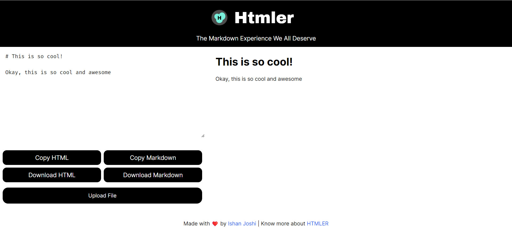

# HTMLer

A simple web based markdown editor.

Yes. That's it! HTMLer is that simple.

But it has some cool stuff. It has some cool little functions that make it different from some other ones.

## Features

1. You can download a HTML page with the markdown content. This page is styled using the github theme for HTML. So you get a clean page.

2. You can copy the HTML code so you can use this for writing a clean HTML blog.

3. The presentation mode which opens up a popup with the markdown content.

4. You can also start right back from where you left by uploading a existing file and start editing it on the go.

## Downloading

Yes! You heard it right!

You can download the single file html page or you can just clone the repository and you can open the index.html page. HTMLer shuffles between the local copies of the javascript files and image assets.

## How I built it

HTMLer is very beginner friendly. It is built with only vanilla HTML , CSS and Javascript. If you are a beginner, this is the project for you. Just add new features or improve a feature and bam! You contributed to the open source community.

## Contributing

To contribute, just solve issue or add a new feature and send a pull request. Once your code is reviewed, it will be merged. All imporvements must be made in the index.html itself and if any external libraries are used, please provide a local copy as well and a cdn link in the html page as well

### Topics to contribute to

- Styling

- More Features

- Translations

- Make it faster

## Conclusion

Yes! If you love this, start using it :)

# [On The Web](https://newtoallofthis123.github.io/htmler)

> NoobScience 2022
